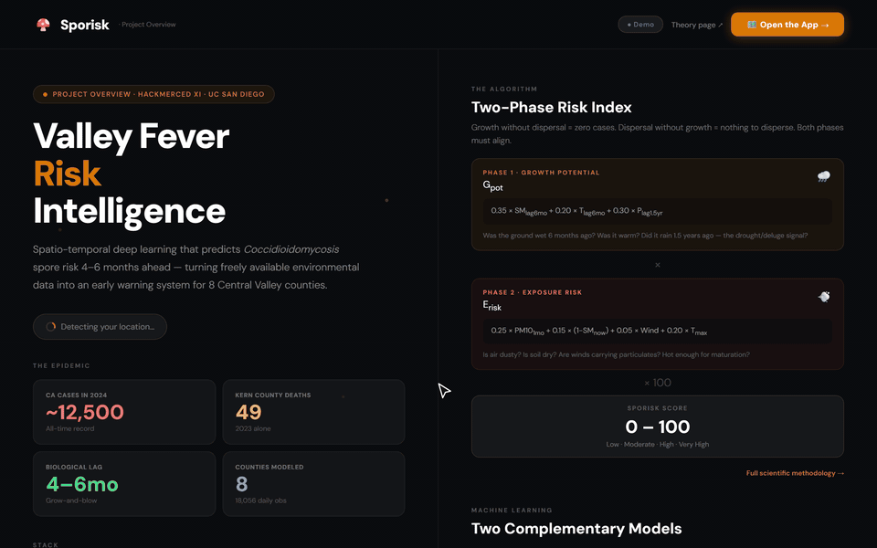
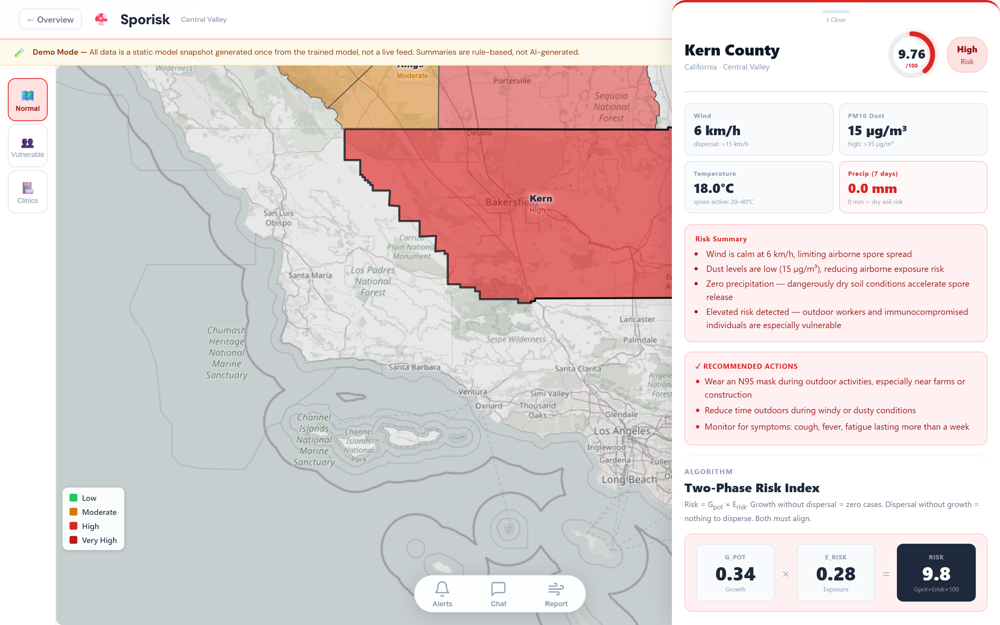
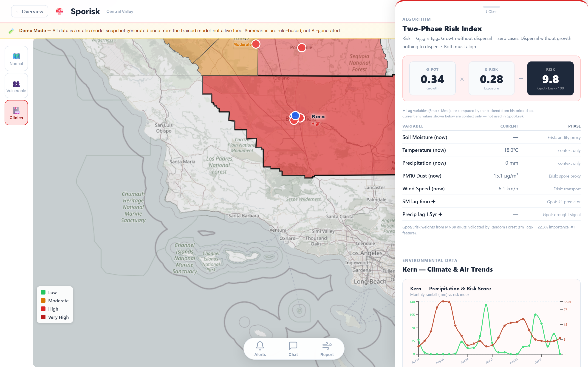
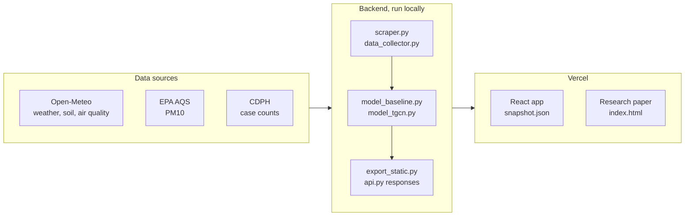

# Sporisk

Valley Fever risk forecasts for California's Central Valley, built on the 4-6 month lag between fungal growth and spore dispersal.

**[Live demo](https://sporisk-main.vercel.app)** · **[Research paper](https://sporisk.vercel.app)** · [Try it](#try-it) · [How it works](#how-it-works)



Sporisk predicts Valley Fever (Coccidioidomycosis) risk for 8 Central Valley counties: Fresno, Kern, Kings, Madera, Merced, San Joaquin, Stanislaus, and Tulare. California recorded about 12,500 cases in 2024, and the fungus lives in the region's soil. A four-person UC San Diego team built Sporisk at HackMerced XI. The project has a React map app, an academic-style research paper, and the Python pipeline that produced the model output.

## Why it works this way

Most risk maps show current conditions. Valley Fever does not follow current conditions. The fungus grows in wet soil, and people inhale its spores months later, when the soil dries and wind lifts dust. Sporisk models these two phases separately and multiplies them ("grow and blow"):

```
Risk = G_pot × E_risk × 100
```

- **G_pot (growth potential)** reads soil moisture and temperature from 6 months earlier and precipitation from 18 months earlier.
- **E_risk (exposure risk)** reads current PM10 dust, soil dryness, wind, and maximum temperature.

Growth without dispersal gives no cases. Dispersal without growth has nothing to disperse. Both phases must align.


## Highlights

- **Forecasts the lag, not the weather.** In the Random Forest baseline, soil moisture from 6 months earlier (`sm_lag6`) is the top feature, at 22.3% importance.
- **Two complementary models.** A Random Forest baseline, and a T-GCN that runs graph convolution over an 8-county adjacency graph and a GRU over months, written in plain NumPy.
- **County detail on click.** Each county sheet shows current conditions, a risk summary, recommended actions, the G_pot × E_risk breakdown, and climate and air-quality history charts.
- **Map overlays.** Clinics and vulnerable zones (farms, schools, worksites) draw on top of the risk map.
- **Truthful demo.** A banner labels all data as a static model snapshot. Summaries are rule-based, the chat answers from keyword rules, and the SMS alert and dust report forms store and send nothing.
- **Runs without infrastructure.** The React app bundles every API response it needs, so the showcase cannot break when a backend expires.





## How it works



1. The scrapers pull daily weather and air quality (January 2020 to March 2026) and CDPH case counts (2020 to 2025, with 2025 provisional) into `Backend/data/`.
2. The models write their predictions to `Backend/baseline_predictions.csv` and `Backend/tgcn_predictions.csv`.
3. `Backend/export_static.py` calls the `Backend/api.py` endpoints the frontend uses and writes the responses to `frontend/src/data/snapshot.json`.
4. The React app reads only that snapshot. It makes no runtime API calls.

`api.py` can generate summaries with Gemini. The committed snapshot uses the rule-based summaries instead.

## Tech stack

| Layer | Tools |
|---|---|
| Frontend | React 19 (Create React App), Recharts, Leaflet |
| Research paper | One static HTML page with inline CSS and JS |
| Backend | Python, FastAPI, pandas |
| Models | scikit-learn Random Forest, T-GCN in NumPy |
| Data | Open-Meteo, EPA AQS, CDPH |
| Hosting | Vercel |

## Try it

Open the [live demo](https://sporisk-main.vercel.app) or the [research paper](https://sporisk.vercel.app). Neither needs an account or a key.

Run the React app locally:

```sh
cd frontend
npm install
npm start   # http://localhost:3000
```

Regenerate the snapshot after you change the model or data, then commit the diff:

```sh
cd Backend
pip install -r requirements.txt
python export_static.py
```

Regenerate the README media after a UI change (needs npm, ffmpeg, and [uv](https://docs.astral.sh/uv/)):

```sh
uv run --with playwright playwright install chromium   # first time only
uv run scripts/capture_media.py
```

## Repository layout

| Path | Contents |
|---|---|
| `frontend/` | React app. Nearly all UI lives in `src/App.js`. |
| `frontend/src/data/snapshot.json` | Static API snapshot, generated by `Backend/export_static.py` |
| `index.html` | Research paper with an interactive risk-index sandbox |
| `Backend/` | FastAPI API, scrapers, scheduler, models, and data. Kept as pipeline evidence, not deployed. |
| `scripts/capture_media.py` | Captures the screenshots and GIF in `docs/media/` |

## Deployment

Pushes to `main` trigger both deployments.

| Vercel project | Root | Serves |
|---|---|---|
| `sporisk-main` | `frontend` | React app, sporisk-main.vercel.app |
| `sporisk` | `.` | `index.html` paper, sporisk.vercel.app |

## Limits

- No live data. The app shows a snapshot of model output, not current weather or new model runs.
- No backend runs in production. The earlier hosted API no longer exists.
- The app publishes no validated accuracy metrics.
- Health guidance is general. It is not a diagnosis.

## Credits

Built at HackMerced XI by Samudera Bagas Aubreyasta, Moch Raka Aryaputra, Olo Hot B. M. S. Margura Silitonga, and Nathan Raphael Martua Nainggolan (UC San Diego).

## License

[MIT](LICENSE)
